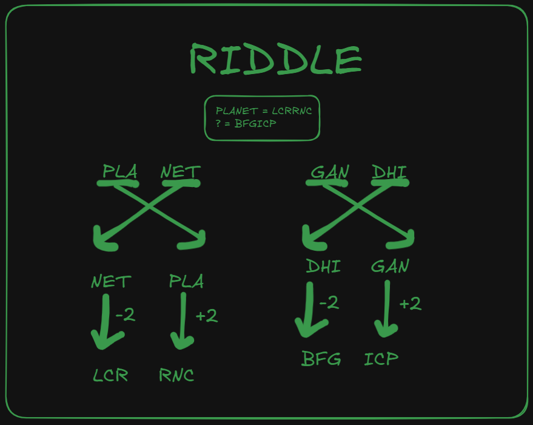

<table border=3 >
<tr>
    <td>** Level : **</td>
    <td> 3 </td>
</tr>
<tr>
    <td>** Mode : **</td>
    <td>Offline</td>
</tr>
<tr>
    <td>** Entry Point : ** </td>
    <td> Hyperlinks in the pdf </td>
</tr>
<tr>
    <td>** Endpoint : ** </td>
    <td>qr Code</td>
</tr>
</table>

## To solve the question

** Solution : ** < GANDHI at the backside of the canteen >  
players scan the QR code and get points

## Description

The final piece of the puzzle links to the location. Decode the cipher and find the right passage to complete the journey.

## Hints

<ol>
    <li>
        Points:<30>
        The cipher isn't random, think about how it might relate to the positions of letters within the words you've uncovered.
    </li> 
</ol>

## Links

https://assets.cryptichunt.in/hunt/tocookorbecooked.jpg

## Solution

<ol>
    <li>In the same file from the previous subpart, there are links embedded</li>
    <li>Under the emoji "s ¯\_(ツ)_/¯", we get redirected to a link with google word doc</li>
    <li>The word doc has a question in morse code</li>
    <li>The coded question is as follows: PLANET = LCRRNC; ? = BFGICP</li>
    <li></li>
</ol>

## Link to next part

NA
