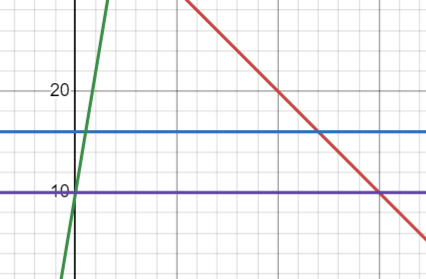

#alienGeometry
<table border = '3'>
    <tr>
        <td>Part :</td>
        <td> 1 </td>
    </tr>
    <tr>
        <td>Mode :</td>
        <td>Online</td>
    </tr>
    <tr>
        <td>Entry Point :</td>
        <td>Riddle</td>
    </tr>
    <tr>
        <td>Endpoint :</td>
        <td>String</td>
    </tr>
</table>

## To solve the question 
 
 
    **Solution :** "AREA51"  
    players enter the string and get points  
 

## Description of the Question

look for patterns and you will see,
what it traps is the key,
is there something alien or weird,
or is everything very straight forward here,
maybe if you pick just a few ,
it will get you through.

7,16
19,10
4,34
15,−5
3,28
0,40
−5,16
−19,10
1,37
20,16
5,40
−10,10

## Hints

For the players
 
<ol>
    <li> **Hint 1 :**  
    Points : 75  
    All you need to form a unique is a set of 3
    </li>

</ol>

## Links 
(if any)

## Solution 

The players will have to use PnC to get 4 pairs of 3 collinear points  - 
(0,40)(1,37)(15,-5)
(5,40)(3,28)(4,34)
(7,16)(20,16)(-5,16)
(-10,10)(19,10)(-19,10)

which forms the line y=-x+40, y=16, y=6x+10 and y=10

which when plotted gives 
 

the area of the trapezium is 51 therefore the code is AREA51
 
## Link to next part

hint: now if what they say is true, what will you actually do 
