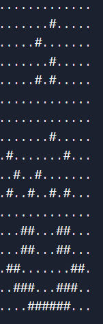

#anAlienMessage

<table border = '3'>
    <tr>
        <td>Part :</td>
        <td> 2 </td>
    </tr>
    <tr>
        <td>Mode :</td>
        <td>Offline</td>
    </tr>
    <tr>
        <td>Entry Point :</td>
        <td>riddle</td>
    </tr>
    <tr>
        <td>Endpoint :</td>
        <td>qr</td>
    </tr>
</table>

## To solve the question

 
 
    QR Ending  
    **Location of QR :* SJT Nescafe*   
    Player gets points on scanning the QR code  
    
## Description of the Question

Trying to talk to aliens is a risky bussiness, but we gotta show them what we are made of.

00000000000000000000100000000001000000000000001000000000010100000000000000000000000000000000000000100000010000000100000100100000000100100101000000000000000000011000110000001100011000011000000011000111000111000000111111000

## Hints

For the players
 

<ol>
    <li> **Hint 1 :**  
    Points : 75 
    we are all made of organic matter, how would you show that to aliens
    </li>

</ol>

## Links

(if any)

## Solution

the give binary string is a message in the same format as Arecibo message which is a message that was sent out in 1974, it's length is 221 which is a mutiple of 2 prime numbers, making the grid it forms unique, the players are supposed to plot the grid either by writting code or finding a website or manually or just using some other denser and lighter characters to represents 1 and 0 in a grid format then if they will look into Arecibi message. 
 
they will be able to decode that the first it says 25 hinting towards SJT and the next code is in the format of how nucleotides are represented in Arecibo message ( that is hinted by the line if the descriotion that says we goota show them what we are made of) and in the end there is a big smilie, on decoding they will get H10C8N4O2P0 or C8H10N4O2P0 which is the chemical formula for caffine, ie the QR being at SJT ( hinted by 25 )
