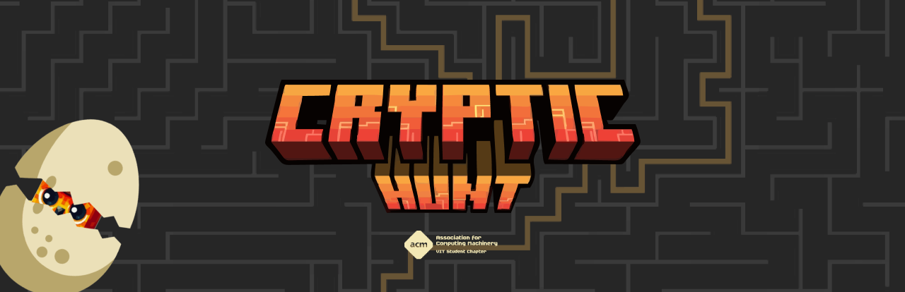

# Cryptic Hunt Solutions 2024

 
## 📜 Overview

**Cryptic Hunt 2024** is a scavenger hunt event organized by **ACM-VIT**, where participants solve cryptic riddles and puzzles to uncover hidden clues. This repository contains a comprehensive list of detailed solutions to each of the challenges presented during the event, aimed at helping fellow participants or enthusiasts understand the approach behind solving them.

For more information about ACM-VIT, visit the official [ACM-VIT Linktree](https://linktr.ee/ACM_VIT).

## 📂 Repository Structure

The solutions are organized by **difficulty levels**. Each folder contains:
- **README**: Detailed problem statement and approach used to solve it.
- **Distributables**: Code, scripts, or files related to the solution.

## 💡 How to Use

1. Navigate to the difficulty level of your choice (`Easy`, `Medium`, or `Hard`).
2. Open the folder corresponding to the question you're interested in.
3. Each folder contains a README file that explains the problem, the approach used, and the final solution, along with any additional files necessary to understand or run the solution.

 
